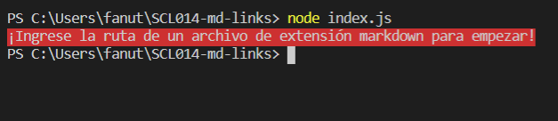
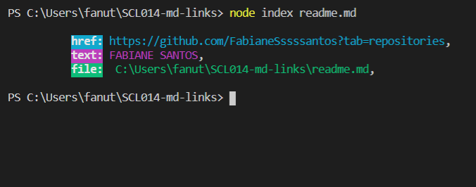

\*blue

# fs-md-links

### validador de links en archivos con extensión markdown.

#

Herramienta desarrollada para encontrar y analizar archivos de extensión markdown (**.md**).

Para instalar la herramienta en su proyecto es muy sencillo, copie y pegue el comando:

#### npm i fs-md-links

#

Es necesario una ruta de un archivo markdown para empezar!

#

Archivo mardown encontrado! Devuelve el _enlace_, el _texto_ y la _ruta_ del archivo markdown.

#

Solo se analiza archivos de extensión markdown!

#

Al ingresar el argumento _--validate_, devuelve además el status del link!

#

Para obtener estadísticas, se utiliza el argumento --stats, que devuelve el total de links encontrados, cuantos del total son unicos, y cuantos links del total están rotos.

#

En este ejemplo hay un total de 4 links, donde 3 links no se repiten, y 1 está roto.

#

En este ejemplo hay 1 link, donde el link es unico y no está roto, o sea, el link funciona perfectamente.

#

## Autora:

#### [Fabiane Santos](https://github.com/FabianeSantos?tab=repositories)
