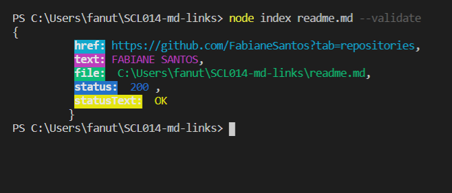

# fs-md-links

### validador de links en archivos markdown.

Herramienta desarrollada para encontrar y analizar archivos de extensión markdown (.md).

Para instalar la herramienta en su proyecto es muy sencillo, copie y pegue el comando:

#### npm i fs-md-links

Es necesario una ruta de un archivo markdown para empezar!

Archivo mardown encontrado! Devuelve el _enlace_, el _texto_ y la _ruta_ del archivo markdown.

Solo se analiza archivos de extensión markdown!

Al ingresar el argumento _--validate_, devuelve además el status de link!

### Autora:

[Fabiane Santos](https://github.com/FabianeSantos?tab=repositories)
